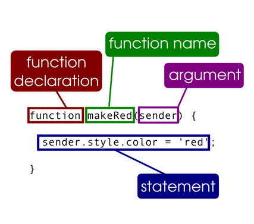
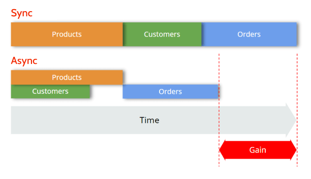

# JavaScript Functions and Callbacks

## Excercises

    - go to script.js
    - to run the script type node script.js

1. [Callbacks](/excercises/callbacks.md)
2. [Callbacks (with map, filter and forEach)](/excercises/mapfilter.md)
3. [Error Handling](/excercises/errorhandling.md)
4. [Asynchronous Callbacks](/excercises/asynchronousCallbacks.md)
5. [this and constructor functions ](/excercises/constructor.md)

 

## What are JavaScript functions?

<figure>
    
    <figcaption><em>Overview over a JS function</em></figcaption>
</figure>

Functions are one of the fundamental building blocks in JavaScript. A function in JavaScript is similar to a procedure—a set of statements that performs a task or calculates a value, but for a procedure to qualify as a function, it should take some input and return an output where there is some obvious relationship between the input and the output. To use a function, you must define it somewhere in the scope from which you wish to call it.

    function square(number) {
    return number * number;
    }

 

## What are JavaScript callbacks?

A callback function is a function passed into another function as an argument, which is then invoked inside the outer function to complete some kind of routine or action.

    function greeting(name) {
    alert('Hello ' + name);
    }

    function processUserInput(callback) {
    var name = prompt('Please enter your name.');
    callback(name);
    }

    processUserInput(greeting);

 

## Asynchronous vs. Synchronous Programming

In **synchronous** operations tasks are performed one at a time and only when one is completed, the following is unblocked. In other words, you need to wait for a task to finish to move to the next one.

In **asynchronous** operations, on the other hand, you can move to another task before the previous one finishes. This way, with asynchronous programming you’re able to deal with multiple requests simultaneously, thus completing more tasks in a much shorter period of time

<figure>
    
    <figcaption><em>Asynchronous vs. Synchronous Programming</em></figcaption>
</figure>

